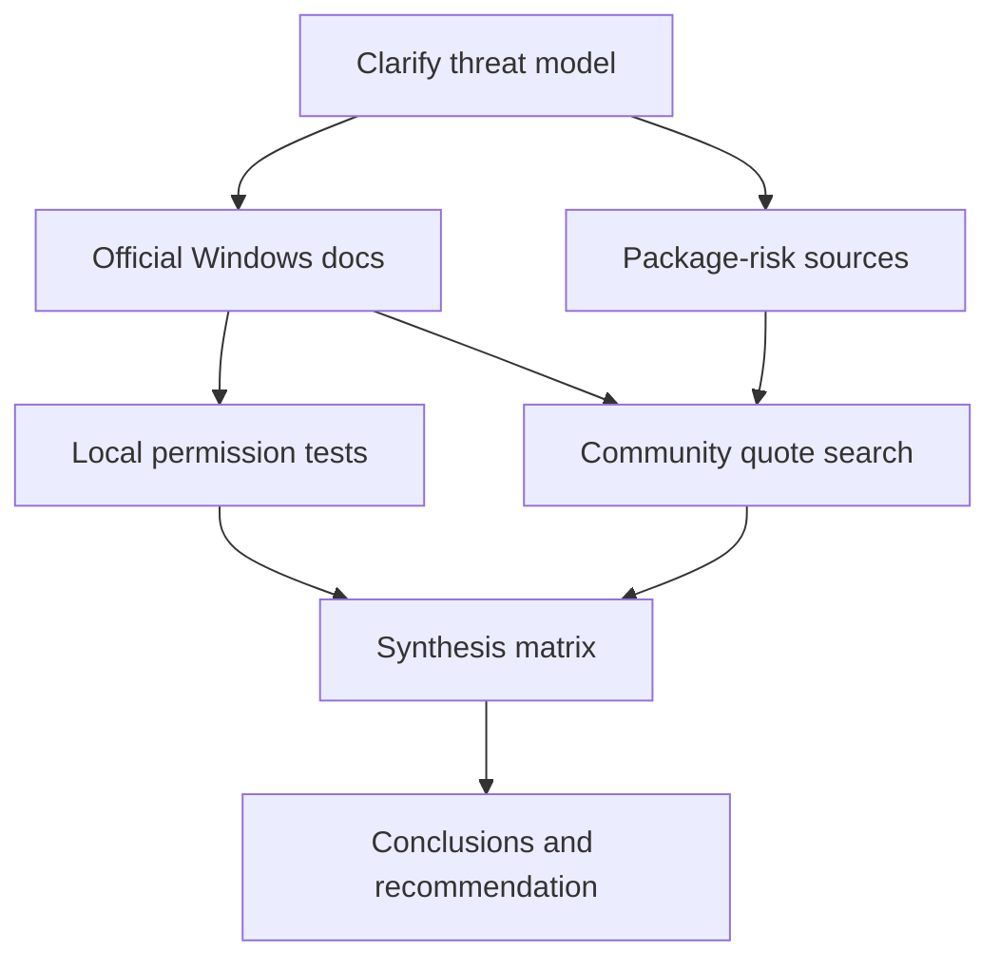

# Research Blueprint for Windows Secondary-Account Isolation

## Executive Summary

Although your prompt describes the topic as unspecified, the uploaded project note provides a concrete and researchable working topic: **running VS Code, `node.exe`, and related developer tools as a less-privileged secondary Windows account so that a malicious npm package has reduced access to the main account’s files and credentials**. The note also shows a specific interest in evidence and quotes containing `runas`, `/user`, `/savecred`, and ideally `code.exe`, with the secondary account being **non-admin** and less privileged than the primary account. fileciteturn0file0

Because you explicitly asked **not to fetch content**, this report does **not** attempt to collect the requested ten webpage quotes. Instead, it gives you a research-ready framework that can be executed later: a scope definition, source hierarchy, literature map, evidence-collection workflow, tables comparing candidate research questions and methods, a prioritized search plan, a day-based timeline, and concrete academic and web search strings. The framework is tailored to the inferred Windows isolation topic, but it is still general enough to adapt if your actual objective turns out to be narrower or broader. fileciteturn0file0

The strongest starting point for this topic is not community discussion, but **official Windows security and process-creation documentation**. Microsoft’s documentation shows that Windows process creation and isolation center on **access tokens**, **security contexts**, and process/object access rights; `CreateProcessWithLogonW` explicitly creates a process under specified credentials, while Windows Sandbox provides a more strongly isolated, hypervisor-based fallback design when account separation is not sufficient. For package-risk validation, npm’s own audit documentation, OSV, and GitHub Advisory Database should be the first-line sources for the malicious-package threat model. For academic framing and related work, Google Scholar, Scopus, Web of Science, arXiv, PubMed, Crossref, and Semantic Scholar are the most useful discovery layers to prioritize. citeturn18view0turn3view3turn19view0turn16view0turn15view0turn15view1turn5view0turn4view0turn4view3turn25view0turn3view1turn12view2turn12view3

The core analytical decision in this research is to distinguish between three separate questions that are often blurred together in forum discussions: **can the program launch**, **what resources can the launched process actually access**, and **whether the usability/security tradeoff is worth it compared with Windows Sandbox or a VM**. The best final report will therefore combine official documentation review, controlled local permission testing, package-risk intelligence, and a targeted quote-gathering pass across community sources. citeturn3view3turn18view0turn19view0turn20view0turn20view1turn16view0turn15view0turn15view1

## Methodology

This research should use a **four-track approach**. The first track is **platform mechanics**: identify how Windows represents user identity, tokens, process creation, and object access. Microsoft states that a process’s security context is derived from the access token, that processes can be created under alternate credentials with functions such as `CreateProcessWithLogonW`, and that process objects and tokens are governed by access-control lists and specific access rights. citeturn18view0turn18view1turn3view3turn18view2

The second track is **empirical verification on a test machine**. Microsoft’s Sysinternals tools are well suited to this: Process Monitor captures real-time file system, Registry, and process/thread activity, while AccessChk reports effective permissions for users and groups on files, directories, Registry keys, services, processes, and other objects. That combination is ideal for verifying whether a VS Code process started under a secondary account can read or write the primary profile, secrets, SSH keys, browser storage, or project directories. citeturn20view0turn20view1

The third track is **package-risk and supply-chain evidence**. npm documents that `npm audit` submits a project dependency description to the registry and asks for known-vulnerability reports; OSV presents itself as a distributed vulnerability database for open source and exposes package/version querying; GitHub Advisory Database provides reviewed and unreviewed open-source advisories including npm packages. These are the correct primary sources when the research question shifts from “is alternate-user launching possible?” to “what realistic dependency threats justify this isolation design?” citeturn16view0turn16view2turn15view0turn15view1

The fourth track is **discovery and synthesis**. Google Scholar is useful for broad cross-disciplinary searching, Scopus and Web of Science for citation mapping and breadth, arXiv for fast-moving computer-science preprints, Semantic Scholar for broad scientific-literature discovery and API-assisted exploration, PubMed for any human-factors or behavioral-security angles, and Crossref for DOI/metadata resolution and citation linking. These sources should be used to identify related work, not as substitutes for official Windows documentation. citeturn5view0turn4view0turn4view3turn25view0turn12view3turn3view1turn12view2

A practical execution flow is shown below. This is a **suggested** visualization for the eventual report, not a result of content collection.

This flow reflects the recommended order of operations: establish the security model first, measure actual access second, and only then harvest community quotes as corroborating or contrastive evidence. citeturn18view0turn3view3turn19view0turn20view0turn20view1turn15view0turn15view1turn16view0

## Literature Review

For this topic, the literature review should be organized into **five bodies of literature**, because each answers a different part of the problem.

The first body is **Windows identity, token, and process-creation mechanics**. Microsoft documentation shows that Windows stores authenticated identity in access tokens, that a process’s security context derives from those credentials, and that `CreateProcessWithLogonW` can create a new process under specified credentials and optionally load that user’s profile. This is the technical core of any claim about whether “run code.exe as another user” is merely a launch trick or a meaningful isolation boundary. citeturn18view0turn3view3

The second body is **object access and effective permissions**. Microsoft’s documentation on process security and token access rights, combined with AccessChk, frames the most important verification question: not whether the alternate-user process starts, but **what it can actually access afterward**. This literature is especially important for the research sub-question about access to the main user’s files, token-derived capabilities, and process-interaction possibilities. citeturn18view0turn18view1turn20view1

The third body is **higher-isolation alternatives and comparative designs**. Microsoft describes Windows Sandbox as a lightweight isolated desktop environment that uses hypervisor-based virtualization, is disposable, and can be used for running untrusted applications; this makes it the most relevant official baseline comparator for a “poor man’s sandbox via secondary account” design. A strong literature review should therefore include both **same-host alternate-user isolation** and **virtualization-backed isolation** so the report can assess security strength against usability and maintenance overhead. citeturn19view0

The fourth body is **software supply-chain risk in package ecosystems**. npm’s audit documentation, OSV, and GitHub Advisories together establish the official evidence pipeline for known dependency vulnerabilities and advisories. These sources do not prove the value of your chosen isolation model on their own, but they provide the threat context for why a developer might wish to confine Node-based tooling. citeturn16view0turn16view2turn15view0turn15view1

The fifth body is **secondary scholarly and discovery infrastructure**. Google Scholar supports broad scholarly discovery across many source types; Scopus is presented by Elsevier as a comprehensive abstract and citation database; Web of Science describes itself as a trusted citation database and emphasizes multidisciplinary discovery across journals, preprints, dissertations, datasets, grants, and patents; arXiv is a free open-access archive with computer-science coverage; Semantic Scholar is a free AI-powered research tool for scientific literature; PubMed is a free NCBI/NLM resource for biomedical and life-science literature; and Crossref provides research-linking infrastructure and metadata. These are valuable for framing adjacent research on least privilege, sandboxing, malware containment, developer security behavior, and evaluative methods. citeturn5view0turn4view0turn4view3turn25view0turn12view3turn3view1turn12view2

### Priority sources to consult first

| Source type | Why it matters for this topic | Priority |
|---|---|---|
| Microsoft Learn on process creation, tokens, and process security | Establishes the Windows security model, alternate-credential process creation, and object access rules. citeturn18view0turn18view1turn3view3turn18view2 | Highest |
| Sysinternals Process Monitor and AccessChk | Enables empirical validation of real file/Registry/process access under the secondary account. citeturn20view0turn20view1 | Highest |
| npm Docs, OSV, GitHub Advisory Database | Grounds the package-risk threat model in official or primary ecosystem sources. citeturn16view0turn15view0turn15view1 | Highest |
| Windows Sandbox documentation | Provides the main official comparison class for stronger isolation. citeturn19view0 | High |
| Google Scholar, Scopus, Web of Science | Supports broad literature discovery and citation chaining for related work. citeturn5view0turn4view0turn4view3 | High |
| arXiv, Semantic Scholar, Crossref | Useful for preprints, discovery augmentation, DOI resolution, and metadata linkage. citeturn25view0turn12view3turn12view2 | Medium |
| PubMed | Relevant mainly for human-factors, behavioral-security, and safety-culture angles. citeturn3view1 | Medium |
| Community sources such as Reddit, Hacker News, Stack Overflow, blogs | Best suited for the requested quote-harvest phase and practical edge cases, but should be subordinated to official documentation. | Medium |

## Data and Findings Framework

Because no topical content is being fetched at this stage, the “findings” section is best treated as a **specification for what data should be collected and how it should be interpreted**. The most important finding implied by the available official sources is that this topic hinges on security context and effective permissions, not just the ability to launch a GUI application under another account. Microsoft’s process-security and token documentation makes that distinction explicit. citeturn18view0turn18view1turn3view3

### Candidate research questions

| Candidate research question | Why it is analytically important | Primary evidence to collect | Best methods |
|---|---|---|---|
| Can VS Code and `node.exe` reliably launch under a non-admin secondary Windows account? | Establishes baseline feasibility before deeper security claims are made. The uploaded note suggests prior success with `runas` for GUI launch. fileciteturn0file0 | Microsoft process-creation docs; user test logs; screenshots; launch traces. citeturn3view3turn18view2 | Documentation review plus controlled launch testing |
| After launch, what can the secondary-account process access on the primary account? | This is the decisive containment question. Windows process and token access rules, plus file ACL evidence, matter more than launch success. citeturn18view0turn18view1 | AccessChk output; ProcMon traces; test files in primary profile; Registry probes. citeturn20view0turn20view1 | Permission auditing and event tracing |
| Does using saved credentials or profile loading materially weaken the design? | This addresses your special interest in `runas`, `/user`, and `/savecred`, and separates convenience from security claims. fileciteturn0file0 | Command-line behavior notes; credential-storage observations; Microsoft credential/process docs. citeturn3view3turn18view1 | Configuration analysis and side-effect testing |
| How does secondary-account isolation compare with Windows Sandbox? | Sandbox is the closest official alternative with stronger isolation expectations. Microsoft describes it as isolated and hypervisor-based. citeturn19view0 | Windows Sandbox docs; usability notes; startup and workflow comparisons. citeturn19view0 | Comparative security-usability analysis |
| What real-world discussions mention `runas`, `/user`, `/savecred`, and `code.exe` in this exact scenario? | This is the quote-harvesting question reflected in your project note and desired output format. fileciteturn0file0 | Webpage/forum posts, blog posts, Stack Overflow threads, GitHub issues, archived docs | Targeted search and source-screening |
| What package-threat evidence best justifies doing this at all? | The research should show whether malicious dependencies are a credible enough risk to justify workflow friction. fileciteturn0file0 | `npm audit`, OSV, GitHub advisories, malware reporting and supply-chain case studies. citeturn16view0turn15view0turn15view1 | Threat-context review and case selection |

### Data sources and their role

| Data source | What it contributes | Strengths | Limits |
|---|---|---|---|
| Microsoft Learn security and API documentation | Formal description of Windows security context, tokens, process creation, interactive desktop requirements, and process/object access. citeturn18view0turn18view1turn18view2turn3view3 | Primary source, authoritative terminology | May not answer every practical edge case of VS Code or Node tooling |
| Sysinternals ProcMon | Real-time trace of file, Registry, and process/thread activity under test conditions. citeturn20view0 | Strong for empirical verification | Must be interpreted carefully to avoid false positives |
| Sysinternals AccessChk | Effective-permission inspection for users, groups, processes, files, services, and Registry paths. citeturn20view1 | Strong for access-control confirmation | Static view; does not replace behavioral tracing |
| Windows Sandbox documentation | Official comparator for stronger, virtualization-backed isolation. citeturn19view0 | Clear security baseline | Different workflow model than same-host alternate-user design |
| npm Docs | Official package-audit and signature-verification workflow. citeturn16view0turn16view2 | Primary ecosystem source | Focused on known vulnerabilities, not all malicious-package behavior |
| OSV and GitHub Advisory Database | Advisory aggregation, API access, ecosystem visibility, and npm coverage. citeturn15view0turn15view1 | Good for scalable threat lookup | Advisory data does not itself measure workstation blast radius |
| Scholarly discovery databases | Related work, methods, and cross-disciplinary framing. citeturn5view0turn4view0turn4view3turn25view0turn12view3turn3view1turn12view2 | Excellent for literature mapping | Often indirect for a concrete Windows implementation question |
| Community webpages | Practical examples and the requested quote corpus | Best for implementation anecdotes and edge cases | Lower authority; requires careful corroboration |

### Suggested charts for the eventual full report

A final researched report would benefit from three visuals. First, a **security-overhead comparison matrix** with columns for secondary account, Windows Sandbox, full VM, and possibly remote dev container. Second, a **source funnel chart** showing how many hits were screened down to the final ten quotes, grouped by source type. Third, an **access-path diagram** showing what the alternate-user process can access locally, remotely, and via inherited environment or profile behaviors. The rationale for these charts comes directly from the underlying distinctions in Microsoft’s process/token model, Sandbox’s explicit isolation model, and the need to separate quote-gathering from technical verification. citeturn18view0turn3view3turn19view0turn20view0turn20view1

## Analysis

The main analytical insight is that this project is not really about `runas` as a command-line novelty; it is about **whether user-account separation on a single Windows host is a meaningful security control for developer tooling**. Your note already hints at this distinction by describing the real goal as protecting the primary account from malicious npm packages, while the `runas`/`/user`/`/savecred` strings are only high-signal search handles for finding relevant evidence. fileciteturn0file0

That leads to a useful research structure with **three layers of proof**. The first is **mechanistic proof**, from Microsoft documentation, that alternate-credential process creation exists and that access depends on tokens, descriptors, and rights. The second is **empirical proof**, from ProcMon and AccessChk, that the actual launched process cannot reach the primary account’s high-value assets under realistic conditions. The third is **ecosystem proof**, from package-vulnerability and advisory sources, that the threat model is serious enough to justify workflow friction. If any one of those layers is missing, the argument becomes incomplete. citeturn3view3turn18view0turn18view1turn20view0turn20view1turn16view0turn15view0turn15view1

A further analytical distinction is between **credential separation** and **system isolation**. `CreateProcessWithLogonW` and related mechanisms create a process in the security context of specified credentials, but Microsoft’s Windows Sandbox documentation describes a different class of containment: disposable, hypervisor-based isolation from the host. That means a final report should avoid overstating the secondary-account approach. A same-host alternate-user design may reduce access to many primary-account resources, but it should be evaluated as a containment and risk-reduction technique, not assumed to be equivalent to virtualization-backed isolation. citeturn3view3turn18view0turn19view0

The quote-harvesting objective also needs disciplined handling. Since your uploaded note asks for ten quotes from webpages and prioritizes search terms like `runas`, `/user`, `/savecred`, and `code.exe`, a later execution pass should use those strings primarily to find candidate sources, but the final analytical report should tag each quote by **source class**, **claim type**, **security relevance**, and **whether it is corroborated by official documentation**. That keeps anecdotal forum evidence from being mistaken for a security guarantee. fileciteturn0file0

A strong final synthesis would probably compare at least **four implementation patterns**:

| Implementation pattern | Likely security strength | Workflow cost | Best use case |
|---|---|---|---|
| Alternate non-admin Windows user for VS Code and Node | Moderate if primary-account data access is truly blocked and verified; relies on host ACLs and token boundaries. citeturn18view0turn18view1turn3view3 | Low to moderate | Everyday development with reduced blast radius |
| Alternate user plus rigorous ACL verification and tracing | Stronger than ad hoc alternate-user launch because it is measured rather than assumed. citeturn20view0turn20view1 | Moderate | Security-conscious individual developer |
| Windows Sandbox for risky trials | Higher isolation because Microsoft describes it as isolated and hypervisor-based, with disposable state. citeturn19view0 | Moderate | Evaluating unknown packages or files |
| Full VM or separate machine | Typically the strongest operational separation, though outside the official sources collected here | Highest | High-risk or high-assurance workflows |

This comparison is partly inferential. The official Microsoft sources directly describe the mechanisms of process/token boundaries and Windows Sandbox isolation; the ranking of “likely security strength” is an analytical judgment built from those mechanisms and should be treated as a hypothesis to validate with local tests, not a completed empirical result. citeturn18view0turn18view1turn3view3turn19view0turn20view0turn20view1

## Conclusions

The most defensible conclusion at this stage is not that the approach works or fails, but that it is **researchable in a disciplined way** and that official Windows documentation gives a strong enough technical basis to investigate it rigorously. The uploaded note already gives a sharply defined operational goal, a provisional hypothesis that GUI launch under another account can work, and specific search-language targets for later quote collection. fileciteturn0file0

The report should therefore proceed on the assumption that the real research problem is:

> **Can a non-admin secondary Windows user account serve as a practical containment boundary for VS Code, `node.exe`, and similar tools, such that malicious npm packages have materially reduced access to the primary account’s files and credentials, and how does that approach compare with Windows Sandbox?**

That formulation aligns your functional goal, your desired evidence format, and the strongest official sources available for the technical substrate. It also keeps the eventual research balanced: neither overly optimistic about `runas`, nor dismissive of a potentially useful “lightweight compartmentalization” pattern. fileciteturn0file0

The current limitation is straightforward: because you asked not to fetch topic content, this report does not yet include actual literature findings, community quotes, reproduced command syntax excerpts, or case-study evidence. Instead, it establishes the architecture for producing a later full report that can gather those materials efficiently and assess them against official Windows and package-ecosystem documentation. citeturn18view0turn3view3turn19view0turn16view0turn15view0turn15view1

## Recommended Next Steps

### Prioritized search plan

| Phase | Objective | Main sources to search | Output |
|---|---|---|---|
| Scope pass | Lock the threat model, OS version, account model, and exact tools in scope | Uploaded note; Microsoft Learn; local test plan scaffolding. fileciteturn0file0 citeturn18view0turn3view3 | Finalized research question and assumptions |
| Platform pass | Document how Windows handles alternate-user process creation and resource access | Microsoft Learn on process security, tokens, client security context, Sandbox. citeturn18view0turn18view1turn18view2turn3view3turn19view0 | Technical background memo |
| Local verification pass | Demonstrate actual allowed and denied accesses | ProcMon and AccessChk. citeturn20view0turn20view1 | Permission matrix and trace appendix |
| Threat-context pass | Collect evidence on npm and open-source package risk | npm Docs, OSV, GitHub Advisory Database. citeturn16view0turn15view0turn15view1 | Threat-context section |
| Scholarly discovery pass | Identify research on least privilege, sandboxing, malware containment, developer security, and package ecosystems | Google Scholar, Scopus, Web of Science, arXiv, Semantic Scholar, Crossref, PubMed. citeturn5view0turn4view0turn4view3turn25view0turn12view3turn12view2turn3view1 | Related-work bibliography |
| Quote-harvesting pass | Find the ten target quotations from webpages | Community sources, blogs, forums, issue trackers, cached docs | Quote appendix with provenance and annotations |
| Synthesis pass | Compare alternate-user isolation against Sandbox and other options | All sources above | Final analytical report |

### Estimated timeline and deliverables

| Day | Work package | Deliverable |
|---|---|---|
| Day 1 | Final scope, threat model, asset list, research questions | One-page scoping memo |
| Day 2 | Official Windows docs review and notes | Technical background brief |
| Day 3 | Local ProcMon and AccessChk testing | Access verification appendix |
| Day 4 | Threat-context research across npm, OSV, GitHub advisories | Threat evidence summary |
| Day 5 | Scholarly literature mapping and citation chaining | Annotated bibliography |
| Day 6 | Web quote collection and source screening | Curated quote appendix |
| Day 7 | Synthesis, comparison framework, final writing | Finished report with recommendations |

If time is tighter, this can be compressed into a **three-day minimum** by merging Days 2–3 and Days 4–5, but seven days is a more realistic schedule for a careful, citation-rich output with appendices.

### Suggested search strings

#### Academic search strings

These are designed for Google Scholar, Scopus, Web of Science, Semantic Scholar, Crossref-linked search workflows, and arXiv when relevant. The goal is not only to find Windows-specific material, but also adjacent research on privilege separation, sandboxing, and supply-chain risk. Google Scholar supports broad scholarly search across many source types; Scopus and Web of Science are especially useful when you want citation chaining and broader discovery controls. citeturn5view0turn4view0turn4view3turn12view3turn12view2turn25view0

| Theme | Suggested search strings |
|---|---|
| Least privilege and compartmentalization | `"least privilege" Windows user account application isolation`; `"compartmentalization" Windows developer workstation`; `"least-privileged user account" Windows security` |
| Process and token model | `"Windows access token" process security context`; `"CreateProcessWithLogonW" security context`; `"Windows process security access rights" token` |
| Sandboxing comparison | `"Windows Sandbox" developer workflow security`; `sandboxing Windows applications usability security`; `virtualization-based isolation developer tools Windows` |
| Package ecosystem risk | `malicious npm packages developer workstation isolation`; `"npm" supply chain attack developer environment`; `"package ecosystem" malware containment Node.js` |
| Empirical methods | `developer endpoint security experiment file system access control`; `usability security tradeoff alternate account sandboxing` |

#### Web search strings

These are tuned to your note, especially the desire to find pages containing `runas`, `/user`, `/savecred`, and preferably `code.exe`. The first block is for official/primary material; the second block is for quote harvesting. fileciteturn0file0

| Search purpose | Suggested search strings |
|---|---|
| Official Windows docs | `site:learn.microsoft.com runas /user /savecred`; `site:learn.microsoft.com CreateProcessWithLogonW VS Code`; `site:learn.microsoft.com process security access rights token Windows` |
| Security alternatives | `site:learn.microsoft.com Windows Sandbox isolated desktop untrusted applications`; `site:learn.microsoft.com Sysinternals Process Monitor AccessChk permissions` |
| Package-risk sources | `site:docs.npmjs.com npm audit known vulnerabilities`; `site:osv.dev npm vulnerabilities`; `site:github.com/advisories npm` |
| General quote harvesting | `"runas" "/user" "/savecred" "code.exe"`; `"runas" "/user" "/savecred" "VS Code"`; `"runas" "/user" "/savecred" node.exe`; `"runas" "/user" code.exe secondary user account` |
| Community search | `site:reddit.com compartmentalization windows separate account code`; `site:news.ycombinator.com runas savecred code.exe`; `site:stackoverflow.com runas /user /savecred code.exe`; `site:github.com "runas" "/savecred" "code.exe"` |
| Broader framing | `"poor man's sandbox" windows separate user account`; `"compartmentalization" windows account untrusted apps`; `"run program as different user for security" Windows` |

### Clarifying questions to ask before the full research run

The following questions would tighten the scope of a later evidence-collection pass:

- Which Windows version and edition are in scope, and is **Windows Sandbox available** on the target machine? Microsoft documents edition support explicitly. citeturn19view0
- Do you want the final answer to evaluate only **built-in Windows mechanisms**, or also third-party tools and workflow variants?
- Is your primary concern **file access**, **credential access**, **network use**, **process injection/inter-process access**, or all of them?
- Do you want the eventual report to treat `/savecred` as in scope for recommendation, or only as a search term to investigate critically?
- Is the desired end state a **daily driver workflow** for all Node/VS Code work, or a **high-risk mode** you use only for unknown dependencies?
- For the future quote appendix, do you want only **official pages and reputable blogs**, or should forums and social discussions be included if clearly labeled?

### Final deliverables to target

A fully executed version of this framework should produce six concrete artifacts:

| Deliverable | Description |
|---|---|
| Analytical report | Main narrative with executive summary, conclusions, and recommendation |
| Quote appendix | Ten vetted webpage quotes with source classifications and annotations |
| Permission matrix | What the secondary account can and cannot access |
| Test appendix | ProcMon and AccessChk methodology, screenshots, and command logs |
| Source bibliography | Official docs, package-risk sources, and scholarly references |
| Comparison matrix | Secondary account vs Windows Sandbox vs heavier isolation options |

At this stage, the best next move is not more speculation. It is to treat the uploaded note as the working problem statement, use official Windows and package-ecosystem sources as the backbone, and reserve community quote gathering for a later, explicitly content-fetching execution phase. fileciteturn0file0 citeturn18view0turn3view3turn19view0turn16view0turn15view0turn15view1