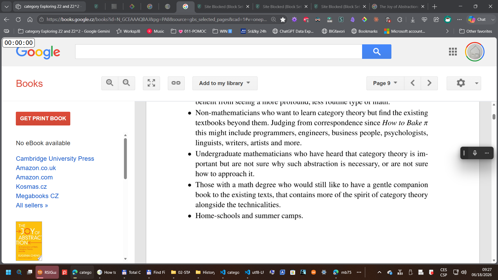

// lots of  ai completion in this file... should be verified #- #TODO 
// my guesses also should be verified #TODO

code "C:\Users\marti\OneDrive\OnClipboardChange-251012\clipboard_log.txt"

category-theory-20260525-607-brainstorming.md

# Category Theory for a Hobbyist (me)

# 20260620
https://gemini.google.com/app/0234a18f4c8ea414

compare diagrams that use arrows
- diagrams in category theory
- semi-formal diagrams
- informal diagrams 
- mind maps
- concept maps
- UML diagrams

- data flow diagrams
- entity-relationship diagrams

# are there some ascii notations for 

in category C,
there is a morphism f: A -> B

in category D,
there is a morphism g: C -> D

...

mermaid syntax for categories?

      f
  A ---> B
   |      |
g |      | h
   v      v
  C ---> D
       k

flowchart TD
  subgraph CatC [Category C]
    A -- f --> B
  end
  
  subgraph CatD [Category D]
    ObjC[C] -- g --> ObjD[D]
  end

Note: In the Mermaid code above, the nodes inside category $\mathcal{D}$ are assigned the internal IDs ObjC and ObjD. This prevents the rendering engine from confusing the object $C$ with the node $C$ from the previous category, while still displaying the correct bracketed text [C] in the final visual output.

# ? were there any attemps at showing arrows of category theory at the level of elementary school 
those are scientific articles ... and in any web forums?

# which books by Eugenia Chen contain arrow diagrams

https://reader.ebooks.com/?uid=258814128&bid=96457709&reqid=163290646&t=639173219415152753&hash=a9a3d345cf9345434421dac934aba97b

"Math is a way of thinking and it definitely is creative... what we do more than trying to answer questions is create worlds in which different answers are possible." –Dr. Eugenia Cheng
This video isn't available anymore

# simple examples of categories

## from searching for examples on the web
obsidian 
20260612.md
In this sense, you can view a category as a kind of combinatorial model for a directed space. Studying the geometry of this space can then help you deduce properties of your original objects and morphisms. It’s as if each area of math has an associated (very complicated) “shape”, given by the shape of its category!

Groups, semi-groups, rings, fields, monoids - distribution, identity, zeros, associstivity, communitavity are pretty trivia to learn - most people already know the underlying concepts and they pop up 
Also, you probably should study axiomatic set theory and abstract algebra before taking on category theory and even in materials like this where they try to bring you up to speed on them, you'll not h
I've gone down this rabbit hole a few times, and I always return pissed off and a dozen hours poorer. Maybe someday I'll get it.

source: "https://news.ycombinator.com/item?id=42291141"

ANew Approach to Understanding Quantum Mechanics:

# C:\Users\marti\OneDrive\Dokumenty\00-MM\category-theory-20260525\abuseofnotation.github.io..md

# ellerman.org-20260612.md

# 20260613

bicategories in computing??

0011 1.pomoc breathing  🌬️  
0012 (L) traveni leku .. yoga mudra.. join fingers 🧘‍♂️    

# math in high school, special classes for gifted students, 

the category of 

- sets and functions between them

- propositions and implications between them
- propositions and proofs?

- sets and relations between them
- sets and partial functions between them?

- sets-with-a-relation and functions that preserve the relation

- ordered sets and monotone functions between them

- groups and group homomorphisms between them
- algebras over a field and linear transformations between them?

- planar geometry: points, lines, planes and transformations between them

- probability spaces and measurable functions between them?

- vector spaces and linear transformations between them
- affine spaces and affine transformations between them?
- metric spaces and continuous functions between them?
- topological spaces and continuous functions between them?

// - any categories in calculus? 
  - 

EDIT WHAT I IMAGINED AS A 2-CATEGORY ... MAYBE THEY ARE MERELY CATEGORIES of small categories of small objects (structures) ?

EDIT A BICATEGORY is not the same notion as a 2-CATEGORY. A 2-category is a category enriched over Cat, while a bicategory is a category weakly enriched over Cat. In a 2-category, the associativity and unity laws hold strictly, while in a bicategory they hold only up to coherent isomorphism. This means that in a bicategory, the composition of morphisms is not strictly associative, but there are natural isomorphisms that relate different ways of composing morphisms. Similarly, the identity morphisms in a bicategory do not necessarily satisfy the unit laws strictly, but there are natural isomorphisms that relate them to the identity morphisms in the hom-categories.
A bicategory is a particular algebraic notion of weak 2-category (in fact, the earliest to be formulated, and still the one in most common use). The idea is that a bicategory is a category weakly enriched over Cat: the hom-objects of a bicategory are hom-categories, but the associativity and unity laws of enriched categories hold only up to coherent isomorphism.

? a category of small ...
?? a 2-category of
?? a bicategory of 

- categories of small algebraic structures, and functors between them
- categories of small sets-with-structure (and structure-preserving functions between the sets  )
- categories of small spaces

# logic ... undergrad logic courses

a category of

- models of a theory and homomorphisms between them?
- theories and interpretations between them?

# computing 

a category of
- types and functions between them (in a statically typed programming language)
- types and functions between them (in a dynamically typed programming language)?

- file formats and converters between them?

- 

- **entity types and relationships between them**?

?? a 2-category of
?? a bicategory of 

- categories of types, and functors between them ...  programming languages and compilers between them?

- E-R diagrams and mappings between them?

- data-flow diagrams and mappings between them??

- state machines and mappings between them??

- data models and mappings between them??

# 20260525 tree homomorphisms  in computing practice

# 20260525 examples of morphisms (category theory) outside of math and computing? ... in AI? linguistics? human cognition? physics? social systems?? economics?? ...... vague morphisms??

//in tree dir?
[[20260525-morphisms--vague.md]]
[[20260525-morphisms.md]]

----

# special meaning of "monoid" in category theory

In category theory, a monoid is a category with a single object. The morphisms of this category correspond to the elements of the monoid, and the composition of morphisms corresponds to the monoid operation. The identity morphism corresponds to the identity element of the monoid. This means that every monoid can be viewed as a category with one object, and conversely, every category with one object can be viewed as a monoid. This special meaning of "monoid" in category theory allows us to study monoids using the tools and concepts of category theory, and it also provides a way to understand categories with a single object in terms of algebraic structures.

# experiment.. constructing a category for a dynamically typed programming language (e.g. JavaScript)

let's consider all values in JavaScript , including null 

let's call predicates.. functions that take a value and return a boolean

for every predicate p, we can define an object O_p that represents the set of all values that satisfy the predicate p.

for every pure function f that takes a value of type O_p and returns a value of type O_q, we can define a morphism m_f: O_p -> O_q that represents the function f.

is this a valid category?

is this construction described somewhere on the web? 

